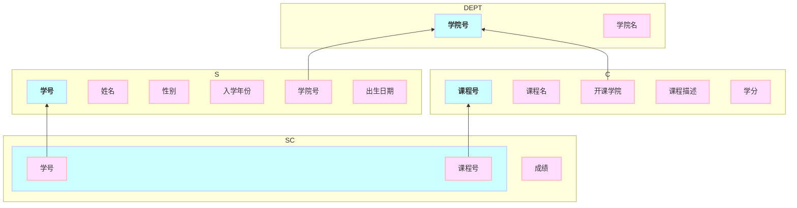

# 数据库结构规划

| 学籍信息 | 约束                   |
| -------- | -------------------- |
| 学号     | PK, String（varchar）  |
| 姓名     | String（varchar）      |
| 性别     | Bool (String enum？)  |
| 入学年份 | String               |
| 学院号    | FK, String (varchar)     |
| 出生日期  | Date                 |

| 学院信息 | 约束                   |
| -------- | -------------------- |
| 学院号     | PK, String（varchar）  |
| 学院名     | String（varchar）      |

| 课程信息 | 约束                 |
| -------- | -------------------- |
| 课程号   | PK, String (varchar) |
| 课程名   | String               |
| 开课学院  | FK, String (varchar) |
| 课程描述 | String NULL          |
| 学分     | double               |

| 成绩信息 | 约束                 |
| -------- | -------------------- |
| 学号     | FK, String (varchar) |
| 课程号    | FK, String (varchar) |
| 成绩     | double NULL           |

